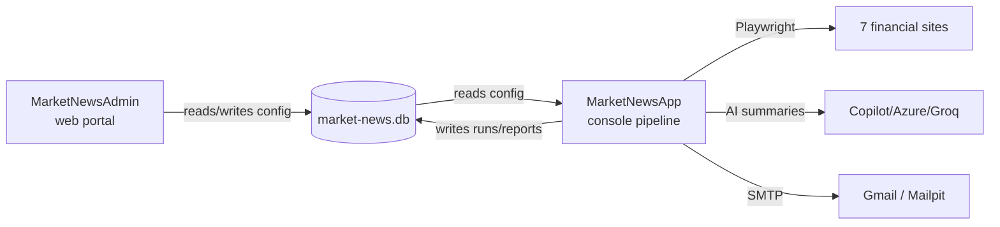

# Market News AI — File-by-File Presentation

## 1. The Big Picture
Two apps share one SQLite database (`market-news.db`) and one shared library layer:
- **`MarketNewsApp/`** — the console **pipeline** (scrape → clean → cache → summarize → email), runs daily.
- **`MarketNewsAdmin/`** — an ASP.NET MVC **web portal** to configure the pipeline, view dashboards, and browse archived reports.
- **`MarketNewsApp.Tests/`** — unit tests.

---

## 2. Pipeline app — `MarketNewsApp/`

### Entry point & config
| File | What it does |
|---|---|
| `Program.cs` | Main entry. Parses CLI flags (`--now`, `--test`, `--source`, `--fresh`, `--debug-dom`), sets up Serilog logging, runs DB migrations, then drives the **5-step pipeline** (`RunPipeline`). Also holds the scheduler loop and helpers like checkpoint fallback and pipeline-failure alert email. |
| `MarketNewsApp.csproj` | Project file — NuGet dependencies (Playwright, MailKit, EF Core, Serilog, Scriban, etc.). |
| `README.md` | Human docs: source list, setup, cache behavior. |
| `.env` | Local secrets/config (not committed). |

### `Models/`
| File | What it does |
|---|---|
| `Models/Models.cs` | Core data shapes: `SiteConfig` (per-site scrape rules), `ScrapedSite` (scrape result + screenshots + diagnostics), `SourceStatus` enum, and summary types. |

### `Services/` — the pipeline stages
| File | What it does |
|---|---|
| `Services/Scraper.cs` | Playwright browser automation. Loads each site, dismisses overlays/cookie banners, extracts article text, and **captures chart/table screenshots from the live page** (ground truth, never AI-rendered). |
| `Services/AiSummarizer.cs` | Produces per-source Greek AI summaries then a synthesized overview. Handles transient-error retries. Talks to AI via the `Agents/` abstraction. |
| `Services/EmailSender.cs` | Renders the Scriban HTML template and sends via SMTP (MailKit). Also sends operational alert emails. |
| `Services/ScrapeCache.cs` | Caches same-day scrape results by content hash so a second run reuses work. |
| `Services/SummaryCache.cs` | Same idea for AI summaries (per-source + final synthesis). |
| `Services/PipelineCheckpointStore.cs` | Persists per-source checkpoints to SQLite so a crashed run resumes instead of restarting. |
| `Services/ConfigurationService.cs` | Loads the `RuntimeConfiguration` (sources, schedule, email, feature flags) from SQLite. |
| `Services/ReportArchive.cs` | Saves generated HTML reports for later viewing in the admin portal. |
| `Services/AuditLogger.cs` | Records audit-trail events. |
| `Services/ProductionMaintenance.cs` | Startup housekeeping (DB pragmas, cleanup of old data) run before the pipeline. |
| `Services/SmtpResilience.cs` | Retry/backoff policy for flaky SMTP sends. |

### `Agents/` — pluggable AI providers
| File | What it does |
|---|---|
| `Agents/IChatAgent.cs` | The interface every AI provider implements + `ChatMessage` record. |
| `Agents/ChatAgentFactory.cs` | Builds the right agent based on `AI_PROVIDER` (Copilot default; Azure/Groq/OpenAI alternatives). |
| `Agents/CopilotChatAgent.cs` | GitHub Copilot SDK provider (default). |
| `Agents/AzureOpenAiChatAgent.cs` | Azure OpenAI provider. |
| `Agents/OpenAiChatAgent.cs` | OpenAI provider. |
| `Agents/GroqChatAgent.cs` | Groq provider. |
| `Agents/FailoverChatAgent.cs` | Wraps two agents — falls back to a secondary if the primary fails. |
| `Agents/OpenAiResilience.cs` | Retry/backoff for OpenAI-style calls. |
| `Agents/AgentSettings.cs` | Config record (model, keys, endpoints) for an agent. |
| `Agents/IAgentSettingsProvider.cs` | Interface for where settings come from. |
| `Agents/EnvAgentSettingsProvider.cs` | Reads agent settings from environment variables. |
| `Agents/SqlAgentSettingsProvider.cs` | Reads agent settings from the SQLite config. |

### `Data/` — database layer (EF Core)
| File | What it does |
|---|---|
| `Data/MarketNewsDbContext.cs` | EF Core context — defines all tables (config, checkpoints, runs, reports). |
| `Data/MarketNewsDbContextFactory.cs` | Design-time factory so `dotnet ef` can create migrations. |
| `Data/ConfigurationEntities.cs` | Entity classes for stored configuration. |
| `Data/ConfigurationSeed.cs` | Seeds default sources/settings into a fresh DB. |
| `Data/Migrations/*.cs` | Ordered schema history (e.g. add source region, add checkpoints, Greek source tuning). Each pair = migration + designer snapshot. |

### `Templates/`
| File | What it does |
|---|---|
| `Templates/email_template.html` | Scriban HTML template for the daily report; screenshots embedded as base64. |

### Local dev helpers
| File | What it does |
|---|---|
| `start-mailpit.ps1` | Launches Mailpit, a local SMTP catcher for testing emails without sending real mail. |
| `report.html`, `synthetic-overview.html` | Generated test artifacts (git-ignored). |

---

## 3. Admin web portal — `MarketNewsAdmin/`

| File | What it does |
|---|---|
| `Program.cs` | ASP.NET setup: DI registration, cookie auth (Administrator role), DB migration, `/health` endpoint, MVC routing (default → Dashboard). |
| `appsettings.json` / `appsettings.Development.json` | Web app config (SQLite path, logging). |

### `Controllers/`
| File | What it does |
|---|---|
| `Controllers/DashboardController.cs` | Landing dashboard (run stats, health). |
| `Controllers/ManagementController.cs` | Edit sources, schedule, email, AI settings; trigger pipeline runs. |
| `Controllers/AccountController.cs` | Login / logout / access-denied. |
| `Controllers/HomeController.cs` | Error page and misc routes. |

### `Services/`
| File | What it does |
|---|---|
| `Services/AdminConfigurationService.cs` | Reads/writes pipeline config in SQLite (the admin side of `ConfigurationService`). |
| `Services/DashboardService.cs` | Aggregates run/health data for the dashboard. |
| `Services/PipelineActivityService.cs` | Reads pipeline run history / activity log. |
| `Services/PipelineRunnerService.cs` | Launches the pipeline on demand (singleton, so only one run at a time). |
| `Services/ReportArchiveService.cs` | Serves archived HTML reports. |

### `Models/` (view models)
`ConfigurationViewModels.cs`, `DashboardViewModel.cs`, `PipelineRunViewModels.cs`, `ReportArchiveViewModels.cs`, `ErrorViewModel.cs` — data shapes passed from controllers to Razor views.

### `Views/` + `wwwroot/`
Razor pages under `Account/`, `Dashboard/`, `Management/`, `Home/`, `Shared/` render the UI; `wwwroot/` holds static CSS/JS/images/libs.

---

## 4. Tests — `MarketNewsApp.Tests/`
| File | What it does |
|---|---|
| `PipelineCheckpointStoreTests.cs` | Unit tests for checkpoint save/resume logic. |

---

## 5. Deployment & infra (repo root)
| File | What it does |
|---|---|
| `compose.yaml` | Docker Compose — runs pipeline + admin (+ Mailpit) together locally. |
| `Dockerfile.pipeline` | Builds the console pipeline container image. |
| `Dockerfile.admin` | Builds the admin web container image. |
| `deploy/rancher.yaml` | Rancher/Kubernetes deployment manifest. |
| `deploy/chart/` | Helm chart for K8s deployment. |
| `.dockerignore`, `.gitignore`, `.copilotignore` | Exclusion rules for Docker builds, Git, and Copilot context. |
| `.github/` | Copilot instructions, skills, and per-language coding rules. |

---

## 6. Generated / disposable (git-ignored)
`artifacts/` (validation snapshots), `debug_shots/` (scrape screenshots for inspection), `logs/` (Serilog JSON), `cache/`, `reports/`, `mailpit-data/`, `report.html`, `synthesis_*.html`, `bin/`, `obj/` — none of these are source; they're build output or test artifacts you can safely delete.

---

**The one-sentence mental model:** the **Admin** portal writes config into SQLite, the **pipeline** reads that config to scrape 7 sites with Playwright, summarizes them via a pluggable **AI agent**, renders an **email**, and both apps run as **Docker containers** sharing one database.
